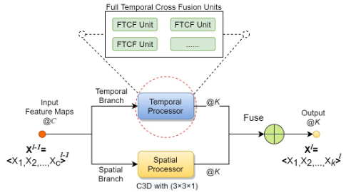

# Full Temporal Cross Fusion Network for Violence Detection in Video

## Introduction

Aiming at the problem of violent video detection, we propose a FTCF-Block which can fuse local spatial and full temporal features, and propose a FTCF-Net architecture based on FTCF-Block for violent video prediction.

## Dependency Package

python 3.7

tensorflow-gpu 2.1.0

## File Description

**dataset** and **pretrained_model_weights** are used to store the processed continuous frame dataset and the network parameters of FTCF-Net which can achieve the best results in the paper.

**network** contains the TensorFlow implementation of FTCF-Block and FTCF-Net.

**experiments_net** contains the TensorFlow implementation of C3D, Conv_LSTM, DenseNet_3D, InceptionNet_3D, I3D and ResNet_3D. In particular, our experimental code for module comparison is in **kernel_length_experiment.py**

**training.py** is used to train the model.

**validating.py** is to evaluate on the testing set.

## FTCF Block

## Dataset

We have uploaded the preprocessed video frames dataset at (http://mirror.×××××.edu.cn/tanOpenLab/   ***WILL OPEN AFTER REVIEW) for you to download. It includes Real Life Violence Situations, Hockey Fight, Violent Flow and Movies Fight.

Video capture process we take the following program：

1. A video data sample is used to extract a continuous video frame sample.
2. Padding for the video whose aspect ratio of video frame is too large.
3. In a video, random starting point is used to extract 30 consecutive frames, and then odd frames are extracted to form 15 consecutive video frames.

In addition, you can download the original video data set through the following connection：

1. RLVS：https://www.kaggle.com/mohamedmustafa/real-life-violence-situations-dataset
2. Hockey Fight：https://academictorrents.com/details/38d9ed996a5a75a039b84cf8a137be794e7cee89/tech&hit=1&filelist=1
3. Movies Fight：https://academictorrents.com/details/70e0794e2292fc051a13f05ea6f5b6c16f3d3635
4. Violent Flow：http://www.cslab.openu.ac.il/download/violentflow/

## Pre-Trained Weights for FTCF-Net

Our FTCF-Net achieves 98.50%, 99.50%, 98.00% and 100.00% accuracy on RLVS, Hockey Fight, Violent Flow and Movies Fight datasets respectively. The model parameters with the best results can be obtained through the following links.(http://mirror.×××××.edu.cn/tanOpenLab/   ***WILL OPEN AFTER REVIEW)

**Related code of this version is designed by anonymity-1, anonymity-2.**
